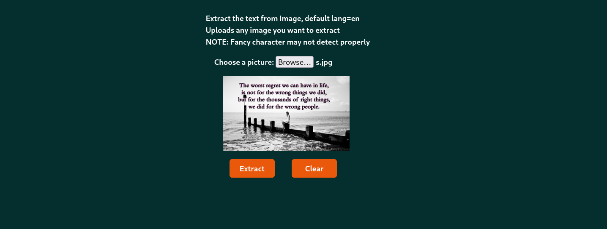

This program Extract the text from the image

1. Make python venv (virtual environment) name whatever you want

2. git clone this repo

```
git clone <url this repo >

```

3. pip install all the dependency in the requirement.txt

```
pip install -r requirement.txt

```

4. Since we are using flask

```
flask --app < whatever your app is | in my case I use web > run
```

5. flask will output the default url that is { localhost:5000 }

6. Pretty fun

### TODO:

- [x] The Basic fundamental
- [x] Style the Page
- [ ] Improvement

### OUTPUT:

1. Upload any image that contain text
   

2. The extract will be display in this play
   

### OUTPUT: with css

1. Upload any image that contain text
   

2. The extract will be display in this play
   
